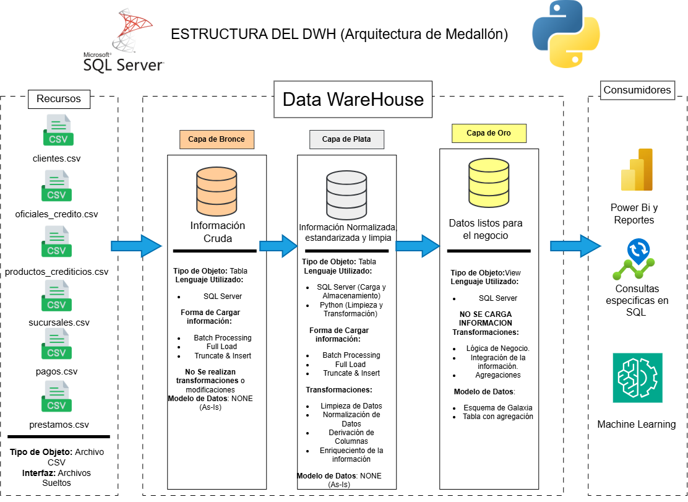
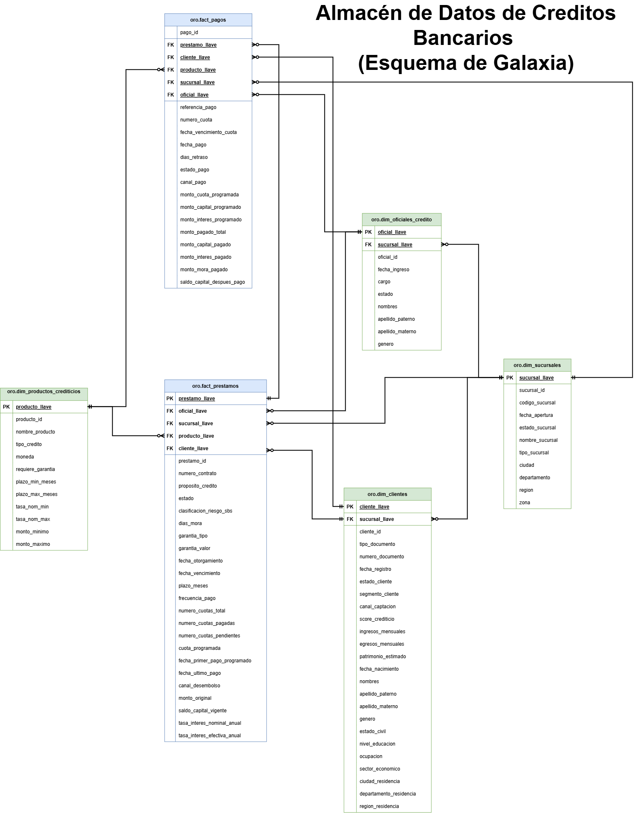

# Data WareHouse Arquitectura Medallón 
--- 

## Arquitectura del Data WhareHouse
Para el desarrolo y creación de este DWH se utilizará la arquitectura de medallón, es decir separaremos este proyecto en 3 capas, bronce, plata y oro.

1. **Capa Bronce**: Almacena la información cruda sin procesamiento o limpieza.
2. **Capa Plata**: Se implementan técnicas y estrategias para la lipieza de datos, estandarización de la información y normalización de procesos. 
3. **Capa Oro**: Se tiene la información lista para el negocio, se realizan reportes, análisis e interpretaciones de información (se utiliza esquema de estrella).  
---

## Modelo de Datos 
Se parte de una relación tipo **Header/Line Fact Tables** (Prestamos / Pagos que son detalles de prestamos, similar a Factura / Detalles Factura), la cual se transforma en un esquema de galaxia, esta decisión se justifica, porque: 
- Se Busca que la capa oro sea un sistema OLAP, es decir priorizar la velocidad por sobre la escritura.
- La granularidad de las tablas pagos y prestamos es diferente, por ende, no siempre vamos a necesitar información de prestamos, sin embargo con una relación tipo **Header/Line Fact Tables**, siempre estaríamos obligados a pasar por prestamos, ralentizando muchas consultas de manera innecesaria.
- Se sigue las recomendaciones de [KIMBALL](https://www.kimballgroup.com/data-warehouse-business-intelligence-resources/kimball-techniques/dimensional-modeling-techniques/header-line-fact-table/) para el modelado de datos de **Header/Line Fact Tables**, en donde se recomienda que todas las claves foráneas del encabezado tienen que incluirse en la tabla hechos de línea.  

---
## Resumen del Proyecto 
0. **Planificación del Proyecto**: Se utilizan herramientas de planificación como [Notion](https://app.notion.com/p/Creaci-n-del-DWH-Arquitectura-Medall-n-375709d2d22980c49aecd0ac98209ef9?source=copy_link), para seguir el avance del Proyecto y Draw.io para la creación de esquemas y estructuras. 
1. **Arquitectura del DWH**: Se implementa una arquitectura moderna de medallón separando el proyecto en 3 capas, **bronce**, **plata** y **oro**.
2. **ETL Pipelines**: Se utiliza un proceso de extracción, transformación y carga de los datos.
3. **Modelamiento de los Datos**: Los datos se modelan siguiendo un esquema de galaxia, es decir tablas dimensión y múltiples tablas fact.
---
## Sobre mi 
Buenos días, buenas tardes o buenas noches, dependiendo de cuando leas esto, mi nombre es Danfer Marcelo Ore, soy estudiante de ING. Sistemas, este proyecto, busca demostrar mis habilidades de planificación, programación e integración de múltiples herramientas.
