Proyecto de análisis de datos
## **Tabla de Contenido**

1. [Ruta del Proyecto](#Ruta-del-Proyecto)
2. [Análisis e interpretación de gráficos](#Análisis-e-Interpretación-de-Gráficos )
   - [EDA Clientes ](#EDA-Clientes)
   - [Análisis Volumen, Características y Calidad de Prestamos](#Análisis-Volumen,-Características-y-Calidad-de-Prestamos)
   - [Análisis de Volumen y Calidad de Pagos](#Análisis-de-Volumen-y-Calidad-de-Pagos)
3. [Sobre Mi](#Sobre-Mi)
---
## Ruta del Proyecto 
Se emplea una gran cantidad de scripts en python utilizando Jupyter Notebook, para una mayor organización, estructuración y visualización de los gráficos.  

1. EDA Clientes: Se implementas gráficos de barras, histogramas y pie, para entender distribuciones, comportamientos y características de los clientes.
2. Análisis Volumen, Características y Calidad de Prestamos: Se implementas gráficos de barras, de línea e histogramas, para entender distribuciones, volúmenes, calidad y características de los prestamos. 
3. Análisis de Volumen y Calidad de Pagos: Se implementas gráficos de barras, de línea e histogramas, para entender distribuciones, volúmenes y calidad de los pagos.

---
## Análisis e Interpretación de Gráficos  
---
### 1. EDA Clientes 
El propósito de esta etapa es identificar las principales características de los clientes.

#### 1.1. Edades 
La mayor cantidad de clientes se encuentran en el rango de 30-55 años, teniendo poca presencia de adultos menores de 30 y una presencia un poco más significativa en adultos mayores de 55.  
Considerando que tenemos un publico **adulto joven**-**adulto medio**, para obtener mayor cantidad de publico joven, existe la posibilidad de brindar microcréditos, teniendo en cuenta a que a los 20 años no se espera tener un gran poder adquisitivo, para el publico mayor a 55 años podemos brindar prestamos con mejores prestaciones.   
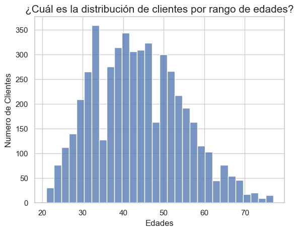  

#### 1.2. Nivel Educativo 
Aproximadamente el 40% de los clientes, tienen estudios universitarios, se tiene poca presencia en postgrado y secundaria, ambos extremos representan la menor proporción de clientes, las razones pueden ser varias, los del nivel secundario pueden deberse a la dificultad para que se les apruebe un crédito, por otro lado las personas con postgrado, puede que no tengan suficientes incentivos para solicitar créditos.  
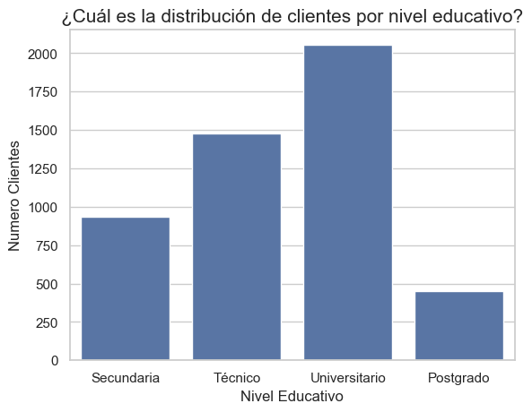  

#### 1.3. Canal de Captación  
La agencia y los medios digitales son los 2 grandes canales para captar clientes, teniendo en cuenta que los clientes son adultos jóvenes y adultos medios, es normal que las campañas en agencia sean las que atraen más clientes, pero, creo que se debe de priorizar las campañas digitales teniendo en cuenta que cada vez más personas consumen contenido por internet.  
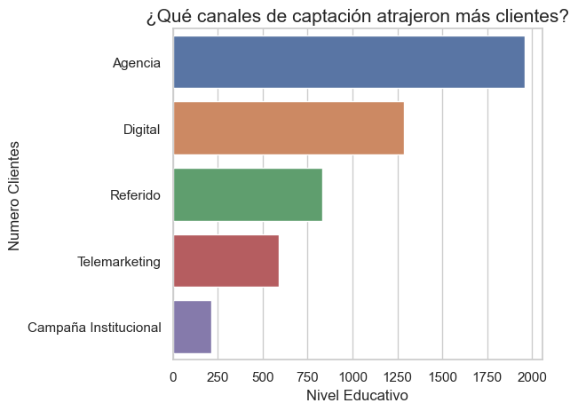  

#### 1.4. Score Creditico  
Esta distribución se asemeje mucho a una distribución normal, pero, presenta dos pequeños grupos de valores atípicos, para scores muy pequeños y scores cercanos a 1000.  
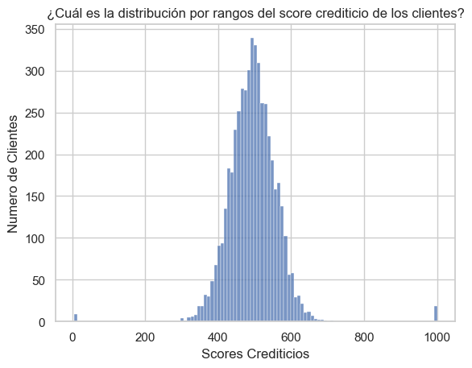

#### 1.5. Ingresos Mensuales
Esta distribución se asemeje mucho a una distribución log normal, con una fuerte concentración en ingresos bajos y medios, pero con una pequeña cantidad de clientes con ingresos altos, en base esta distribución, los productos se pueden centrar en esas categorías bajas-medias, segmentación de clientes y nuevas campañas para captación de clientes.  
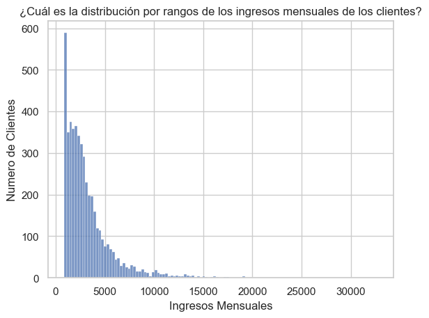  

#### 1.6. Estado Civil
La gran mayoría de clientes son casados o solteros, se entiende que las personas casadas tienen una mayor estabilidad económica.  
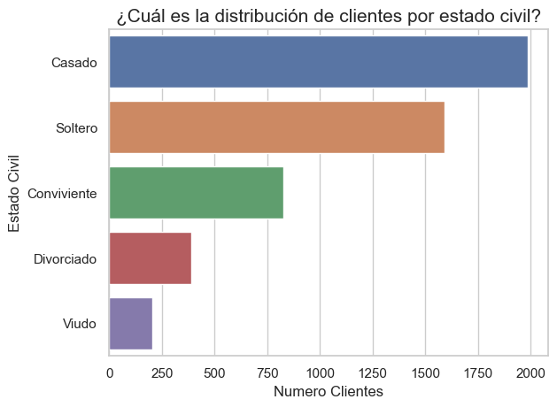  

#### 1.7. Clientes por Departamento
La mayor cantidad de clientes están concentrados en Lima, La Libertad y Arequipa, se entiende que es por la cantidad de población que tienen estos departamentos.  
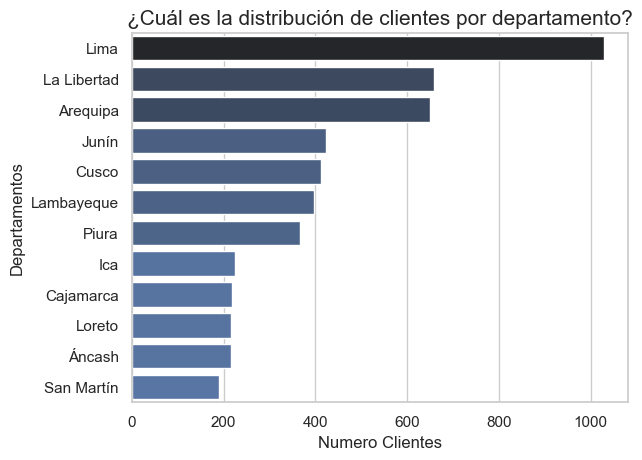  

---
### 2. Análisis Volumen, Características y Calidad de Prestamos
El propósito de esta etapa es analizar el volumen de prestamos a lo largo de los años, la características de estos como montos totales, plazos de pago y tasas efectivas anuales, además de la calidad que tienen.  
#### 2.1. Tendencia Prestamos
Se comienza el 2020 con una cantidad aceptable de prestamos y luego caídas pequeñas en el 2021 y 2022, aunque en cierta parte pueden ser causadas por la pandemia, en el 2023 se presenta una recuperación y se supera la cantidad de prestamos del 2020, sin embargo, en el 2024 se tiene una gran caída en la cantidad de prestamos originados, las razones pueden ser varias. 
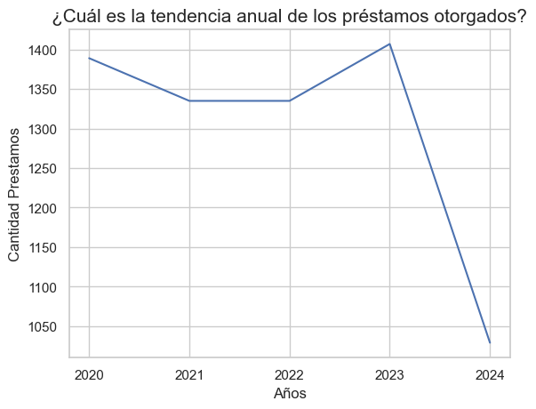  

#### 2.2. Tendencia Montos 
Se comienza el 2020 con una cantidad de montos totales aproximadamente de 43 Millones y luego una subida en 2021 de aproximadamente 46 Millones, algo interesante es que la cantidad de prestamos en 2021 es menor a los prestamos 2020, sin embargo, el monto prestado es mayor en 2021, en el 2022, se tiene una caída en los montos prestados, a pesar de tener una cantidad de prestamos similar al 2021, en 2023 nuevamente aumenta la cantidad de montos prestaos, fruto de una reactivación económica luego de la pandemia y el 2024 vuelve a caer al igual que la cantidad de prestamos que se dieron.  
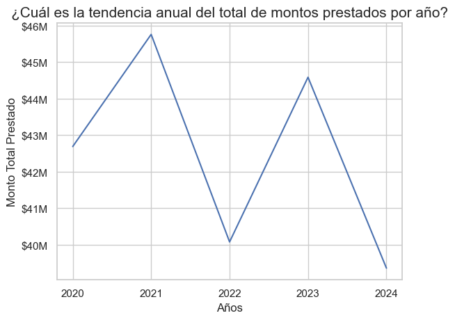  

#### 2.3. Prestamos por sucursales
La sucursal que tiene mayor cantidad de prestamos es Trujillo 1 y Oficina Principal de Ica, a pesar de no tener tanto clientes en dichas sucursales, algo interesantes que la sucursal de Lima tiene relativamente pocos préstamos, considerando que tiene mayor cantidad de clientes y de población como tal.  
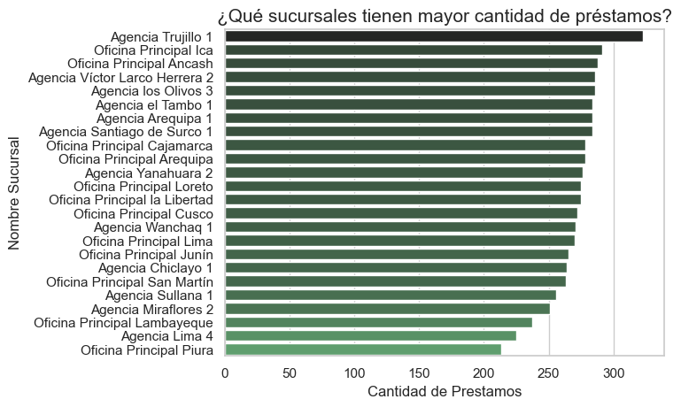  

#### 2.4. Tendencia de Productos Crediticios 
El producto que más prestamos tiene a lo largo de los años es el Crédito Personal Libre Disponibilidad, que representa todos los años aproximadamente el 25% o el 30% del total de préstamos dados, otros productos importantes y estables son MYPE capital de Consume y Crédito de Consumo que representan del 20% al 24% del total de préstamos por año, el resto de productos, tiene participaciones más bajas siendo las más bajas Crédito Hipotecario USD y Crédito Educativo, el crédito educativo con tan baja participación podría ser la razón por las que tenemos tan pocos clientes de postgrado.  
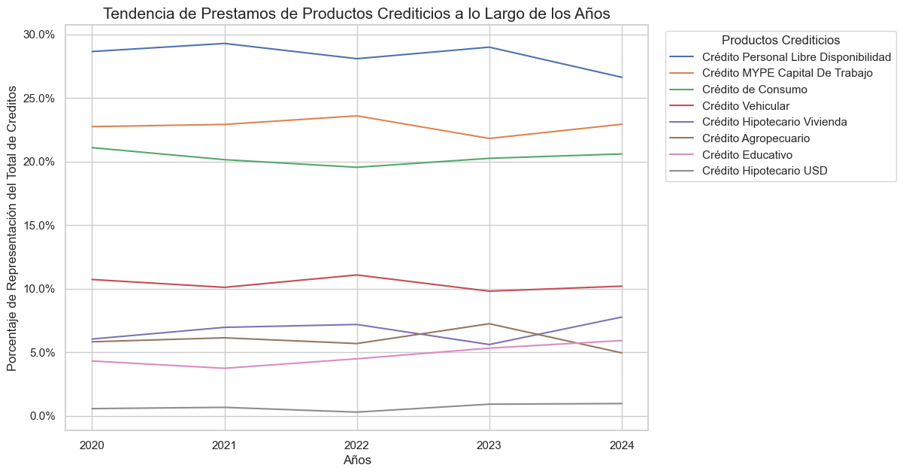

#### 2.5. Canales de Desembolso
En términos generales, los prestamos parecen que se desembolsan en los 3 diferentes canales en igual proporción.  
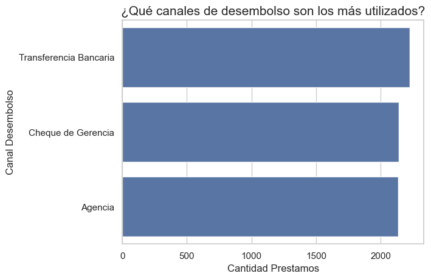  

#### 2.6. Tendencia Tasa Efectiva Anual
La mediana de la tasa efectiva, ha estado de baja desde el 2021, con una caída del 1.6%, no es una caída muy grande, pero sigue siendo un problema a considerar, aunque teniendo en cuenta que la cantidad de préstamos esta a la caída no terminan siendo buenas señales para la empresa.  
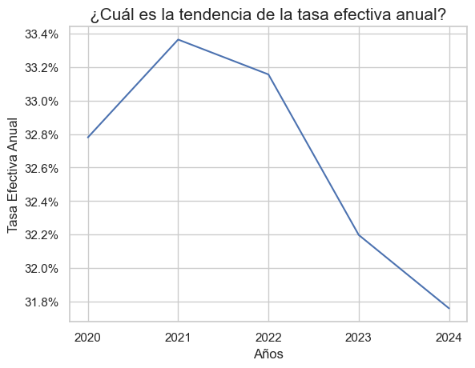  

#### 2.7. Monto Original Vs Tasa Efectiva Anual
El producto que mayor tiene una mediana de monto original mayor es el **Crédito Hipotecario USD**, pero también es el que tiene menor tasa efectiva anual, algo similar ocurre con el **Crédito Hipotecario Vivienda**, que tiene una tasa efectiva anual baja pero un monto original alto, algo que tiene sentido por la naturaleza de ambos prestamos, el resto de los préstamos, tienen montos originales menores a 60k, algo que coincide con la distribución de ingresos de los clientes que son ingresos bajos-medios, los productos que tienen mayor tasa efectiva anual, son **Créditos de Consumo** y los **Créditos Agropecuarios**, ambos cercanos al 45%.  
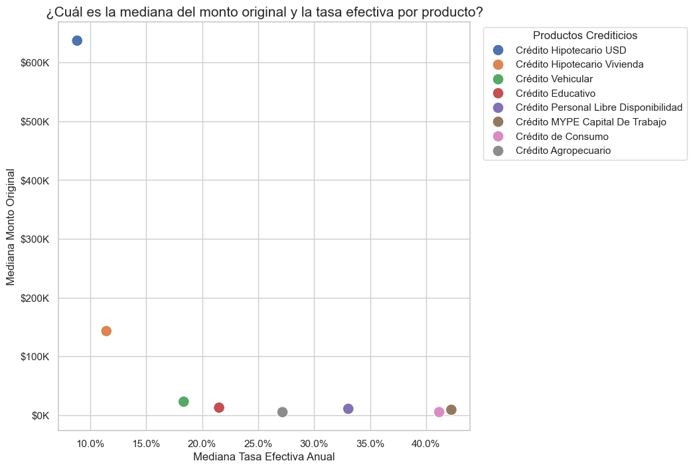  

#### 2.8. Plazo meses
En términos generales, los plazos en meses coinciden con el tipo de crédito, los créditos Hipotecarios tienen mayor duración y el resto de créditos están dentro de un plazo aceptable.   
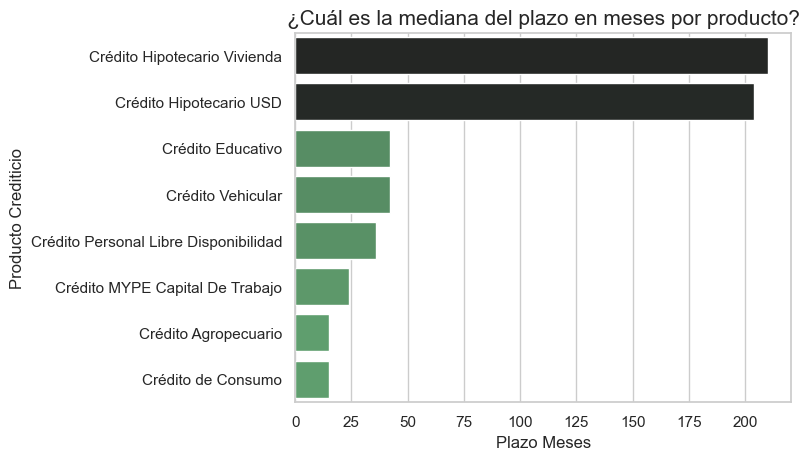  

#### 2.9. Clasificación Riesgo SBS
**La cartera de prestamos es saludable**, teniendo en cuenta que la gran mayoría de prestamos, presentan una categoría normal, y la cantidad de productos crediticios con pérdida es pequeña.  
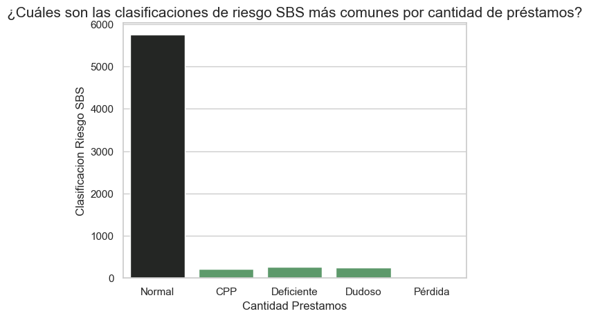  

#### 2.10. Monto por Clasificación Riesgo SBS
**La cartera de préstamos es saludable**, tomando en cuenta que el monto acumulado de los prestamos por Clasificación de riesgo SBS, esta concentrado en categoría Normal, y los montos en pérdida son muy bajos.   
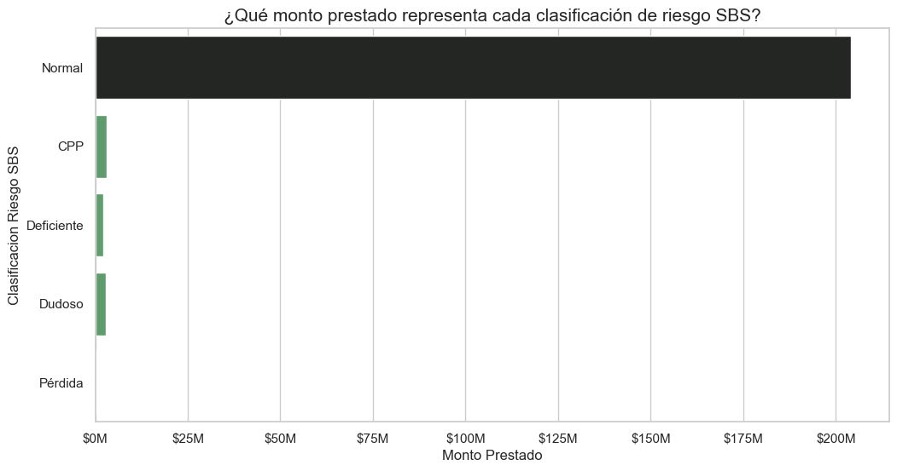  

#### 2.11. Distribución Días Mora por Producto Crediticio 
Los productos crediticios tiene pocos días de mora, reflejo de ello, es que los días de mora están concentrados dentro del rango de 0-10 días de mora.   
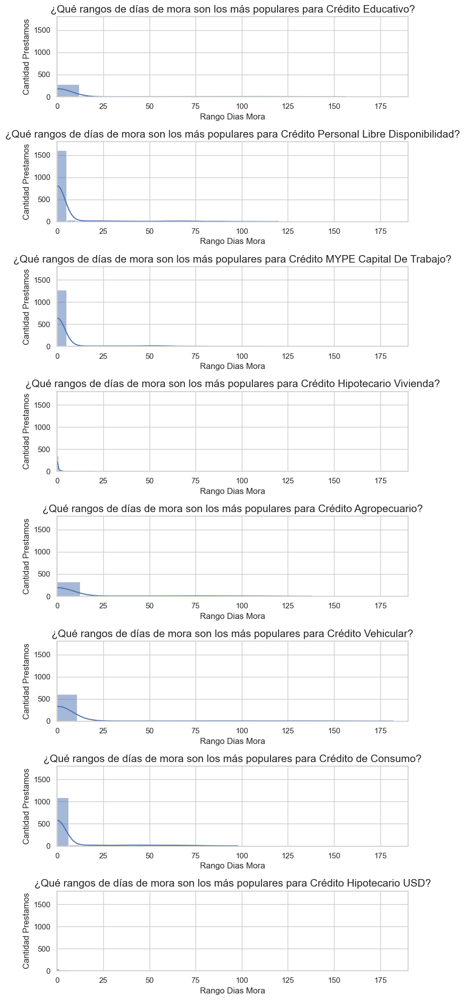 

---
### 3. Análisis de Volumen y Calidad de Pagos
El propósito de esta etapa es analizar el volumen de pagos a lo largo de los años y la calidad que tienen.  
#### 3.1. Tendencia Pagos
La cantidad de pagos realizados aumentaron desde el 2020 hasta el 2024, comenzando con aproximadamente 7k préstamos hasta un máximo de 40k, para luego tener una caída drástica en 2025, la razón principal de esto es que en 2025 apenas se estaba empezando y todavía no se tienen muchos registros de este año, lo más interesante es que el número de prestamos fue irregular, pero a pesar de eso la cantidad de pagos a ido aumentando, un aspecto a tener en cuenta, es que los préstamos duran varios años, entonces, el impacto de no a ver dado muchos prestamos en años pasados, se verá más adelante.  
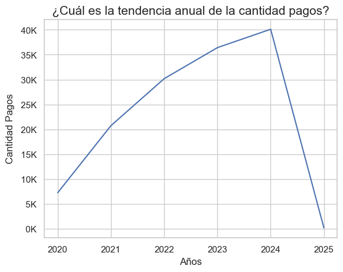  

#### 3.2. Tendencia Ingresos Generados por Intereses 
La cantidad ingresos generados por el pago de intereses ha ido en aumento desde el 2020 al 2024, con un mínimo en el 2020 de 5 Millones y un máximo de aproximadamente 20 Millones en el 2024, luego en el 2025 tiene una caída, porque no se tienen registros de ese año.  
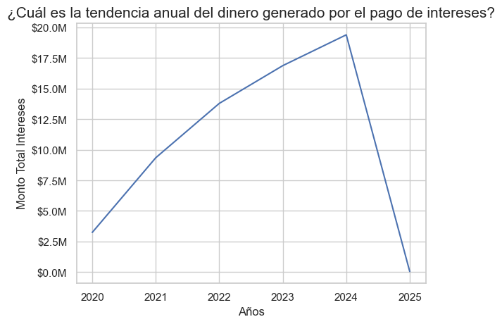  

#### 3.3. Tendencia Ingresos Generados por Mora 
La cantidad ingresos generados por el pago de mora ha ido en aumento desde el 2020 al 2024, con un mínimo en el 2020 de 50k  y un máximo de aproximadamente 350k en el 2024, luego en el 2025 tiene una caída, porque no se tienen registros de ese año.  
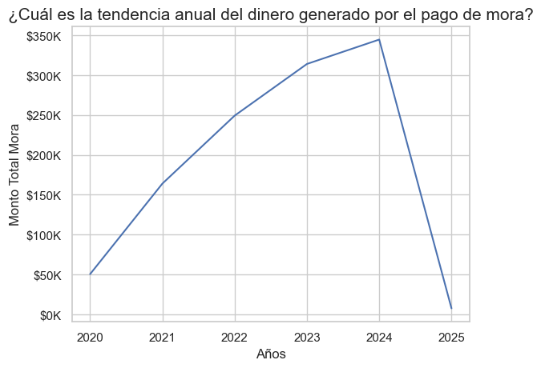  

#### 3.4. Tendencia Pagos por Capital
La cantidad dinero pagado por capital ha ido en aumento desde el 2020 al 2024, con un mínimo en el 2020 de 4.8 Millones y un máximo de aproximadamente 20.2 Millones en el 2024, luego en el 2025 tiene una caída, porque no se tienen registros de ese año.   
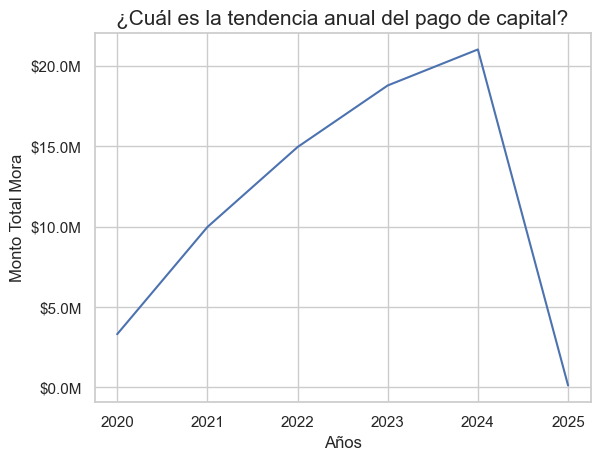

#### 3.5. Cantidad de Pagos por Sucursal 
La sucursal que tiene mayor cantidad de pagos es **Agencia Trujillo 1** seguido de **Agencia Yanahuara 2**, un aspecto a tener en cuenta, es que muchas agencias que se encuentran en la parte superior, no son las que más prestamos tienen asociados.  
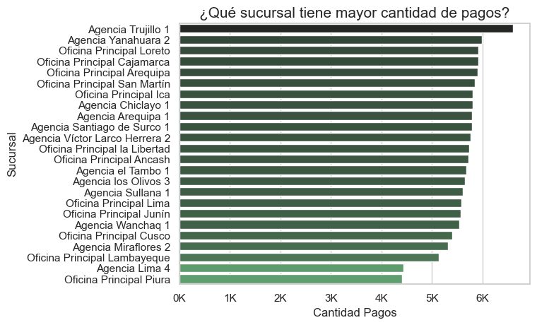  

#### 3.6. Ingresos por Sucursal 
La sucursal que más ingresos (interés + mora) ha generado, es la agencia **Oficina Principal Arequipa** seguido de **Oficina Principal Loreto**, aquí el aspecto más importante a considerar, es que estas oficinas, no son las que más préstamos dan, ni tampoco las que tienen mayor cantidad de pagos, lo más probable, es que son agencia que tengan mayores tasas de intereses o presten montos más altos.   
  

#### 3.7. Ingresos por Producto Crediticio
Los productos que han generado más ingresos (interés + mora) son **Crédito Hipotecario Vivienda**, **Crédito Personal Libre Disponibilidad** y **Crédito MYPE Capital de Trabajo**, algo a destacar es que **Crédito Hipotecario Vivienda** tiene pocos préstamos y una tasa de interés relativamente baja, pero aún así representa una parte significativa de los ingresos de la empresa, el resto de productos, no tienen un comportamiento tan destacable.  
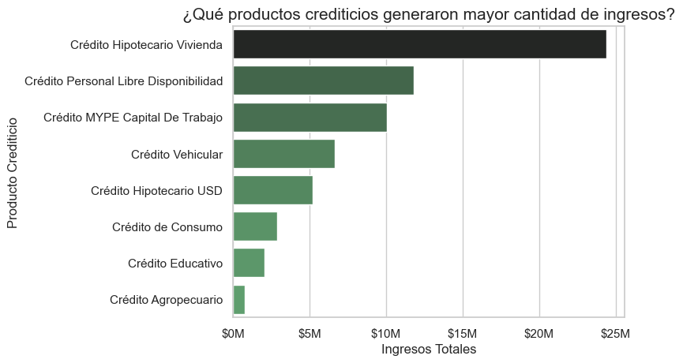  

#### 3.8. Movimiento de Dinero por Canal
El Aspecto más importante es la digitalización de los pagos, la **APP Móvil** es el canal por el cual más pagos se realizan y también es la que más dinero mueve, por otro lado la Web Bancario también se encuentra en un solido cuarto lugar, sin embargo, aún existe una gran cantidad de clientes que prefiere los canales físicos, es decir existe un gran avance en la digitalización de pagos, no obstante, el número de clientes que aún prefieren los canales tradicionales es considerable.  
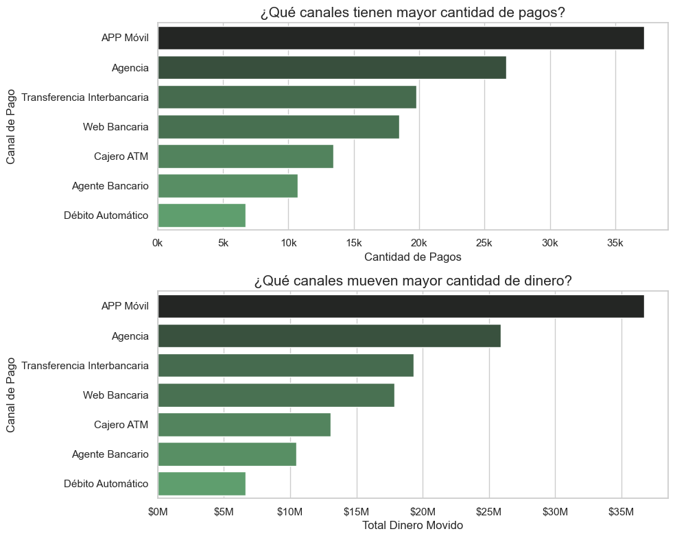  

#### 3.9. Estado de Pago
**La cartera de pagos es saludable**, teniendo en cuenta que la gran mayoría de prestamos, presentan un estado **Puntual** o **Con Gracia**, muy pocos pagos entran en categorías **Tardío** o **Muy Tardío**.
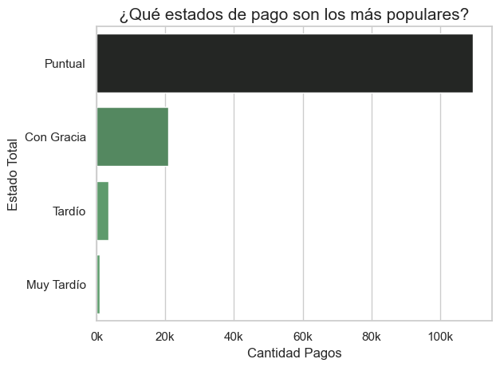

#### 3.10. Rango Días Retraso por Pago por Producto Crediticio
Los productos crediticios tiene pocos días de retraso, reflejo de ello, es que los días de retraso están concentrados dentro del rango de 0-10 días de retraso.   
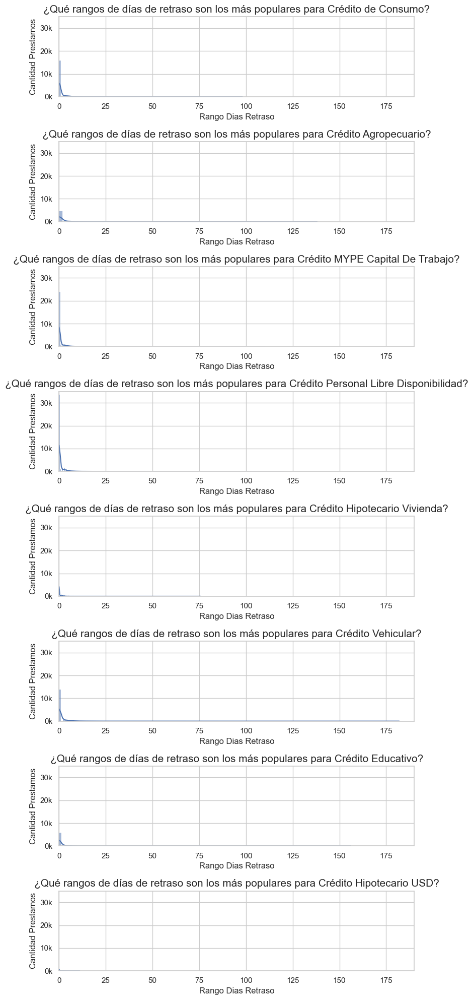  

--- 
## Sobre Mi 
Buenos días, buenas tardes o buenas noches, dependiendo de cuando leas esto, mi nombre es Danfer Marcelo Ore, soy estudiante de ING. Sistemas, la finalidad del proyecto es poder explorar, analizar y realizar un informe con los datos analizados de una cartera de créditos bancarios. 
Con este proyecto busco mostrar mis capacidades con el manejo de herramientas de organización como Notion y draw.io, herramientas de análisis como python, liberarías como pandas, seaborn y matplotlib, pero más importante que la implementación de librerías o tecnologías, quiero mostrar mi capacidad de análisis de información e interpretación de gráficos.   
