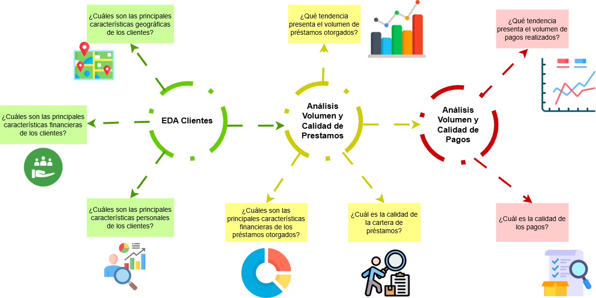

# Analisis-de-Datos
Proyecto de análisis de datos
---
## Ruta del Proyecto 
Se emplea una gran cantidad de scripts en python utilizando Jupyter Notebook, para una mayor organización, estructuración y visualización de los gráficos. 

1. EDA Clientes: Se implementas gráficos de barras, histogramas y pie, para entender distribuciones, comportamientos y características de los clientes.
2. Análisis Volumen, Características y Calidad de Prestamos: Se implementas gráficos de barras, de línea e histogramas, para entender distribuciones, volúmenes, calidad y características de los prestamos. 
3. Análisis de Volumen y Calidad de Pagos: Se implementas gráficos de barras, de línea e histogramas, para entender distribuciones, volúmenes y calidad de los pagos. 
--- 
## Sobre Mi 
Buenos días, buenas tardes o buenas noches, dependiendo de cuando leas esto, mi nombre es Danfer Marcelo Ore, soy estudiante de ING. Sistemas, la finalidad del proyecto es poder explorar, analizar y realizar un informe con los datos analizados de una cartera de créditos bancarios. 
Con este proyecto busco mostrar mis capacidades con el manejo de herramientas de organización como Notion y draw.io, herramientas de análisis como python, liberarías como pandas, seaborn y matplotlib, pero más importante que la implementación de librerías o tecnologías, quiero mostrar mi capacidad de análisis de información e interpretación de gráficos.   
