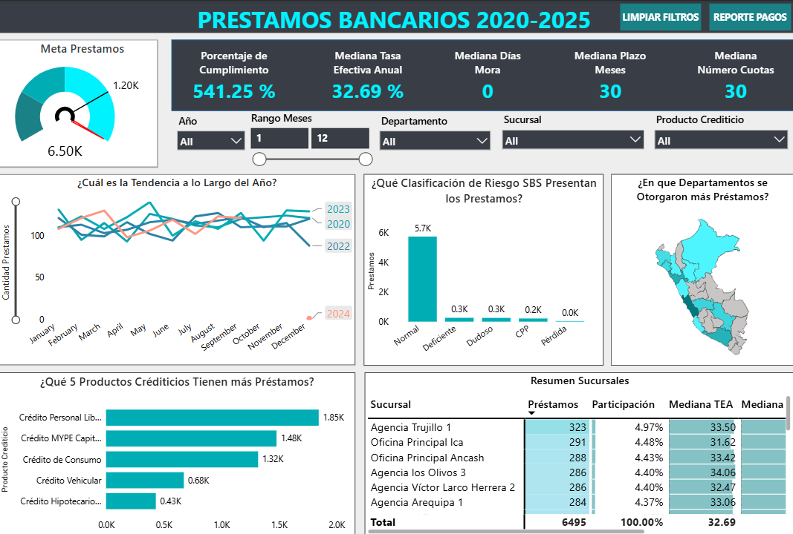
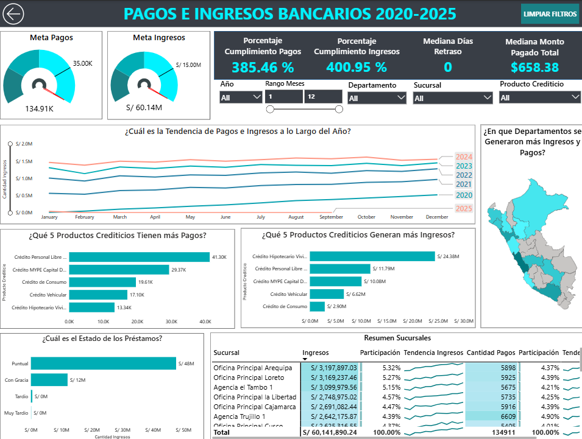

# Reporte-Prestamos-Bancarios

## Introducción
Este dashboard fue creado para que **la gerencia de ventas**, pueda obtener una reporte fácil de entender.  
Este reporte muestra indicadores claros de ventas, análisis a lo largo del tiempo, características de préstamos, ingresos y pagos. 

## Resumen del Dashboard
### Página 1: Reporte Prestamos

Es una vista general de los préstamos bancarios de la empresa, busca mostrar la cantidad de préstamos otorgados a lo largo del tiempo, por productos crediticio y por departamento. Se muestran KPIs como `Porcentaje de Cumplimiento`, `Mediana Tasa Efectiva Anual`, `Mediana Días Mora`, etc. 
### Página 2: Reporte de Clientes

Es una vista centrada en la información sobre los pagos e ingresos a lo largo del periodo 2020-2025, se muestran  Se muestran KPIs como `Porcentaje Cumplimiento Pagos`, `Porcentaje Cumplimiento Ingresos`, , `Mediana Monto Pagado Total` y `Mediana Días Retraso`. Se implementan gráficos de barras horizontales, mapas geográficos, mas de líneas y matrices para visualizar información sobre sucursales 

## Habilidades Mostradas
  - **Esquema de Galaxia**: Se implementa un esquema de galaxia con múltiples tablas fact: `fact_pagos` y `fact_prestamos`, además de múltiples tablas dim: `dim_clientes`, `dim_sucursales`, `dim_oficiales_credito`, `dim_productos_crediticios` y `dim_fechas`.
- **Métricas Específicas**: Se desarrollan métricas orientadas a negocio que permiten obtener KPIs clave como `Mediana Tasa Efectiva Anual` y `Porcentaje de Cumplimiento`.
- **Gráficos Relevantes**: Se emplean **gráficos de barra horizontales** y **línea**  para analizar comparaciones y tendencias temporales.
- **Análisis Geoespacial**: Se incorporan **gráficos de mapa** para representar la distribución geográfica de ventas por departamento en el Perú.
- **KPIs y Tablas**: Se utilizan **tarjetas** para destacar indicadores clave como `Mediana Días Mora`, `Porcentaje de Cumplimiento` y `Mediana Tasa Efectiva Anual`. Las tablas complementan el análisis mostrando el detalle de la información visualizada en los gráficos principalmente de prestamos, pagos e ingresos. 
- **Diseño del Dashboard**: Se diseña una interfaz clara, intuitiva y visualmente amigable, priorizando la simplicidad y enfocando cada sección en los elementos más relevantes para el análisis.
- **Reporte Interactivo**:
  - **Filtros**: Implementación de filtros dinámicos por año, meses, departamento, sucursales y productos.
  - **Botones y Bookmarks**: Uso de controles interactivos para optimizar la navegación del usuario, `REPORTE CLIENTES` y botón para retroceder.
- **Power Query**: Uso de `Power Query` para la transformación y limpieza de datos y columnas reemplazar nulos por `n/a`, para poder limpiar el archivo csv de **[BCR-Tipo de Cambio](https://estadisticas.bcrp.gob.pe/estadisticas/series/diarias/resultados/PD04638PD/html/2019-01-01/2026-08-18/)**, añadir fechas que no tenían tipo de cambio, que tenían tipo de cambio `n.a`, además de la implementación de **merge**, para combinar los tipos de cambio.
- **Vista de Modelo**: Modelado de datos mediante la relación entre tablas `dim` y las tablas `fact`, incluyendo la configuración de filtros unidireccionales.
- **DAX**: Desarrollo de cálculos avanzados utilizando `DAX`, incluyendo la creación de columnas como `rec_monto_total` y tablas completas como `dim_fecha`.
- **Edición de Interacciones**: Se optimizan las interacciones entre las diferentes tablas con el objetivo de mejorar la dinámica y usabilidad del reporte.
## Conclusiones
Este Dashboard muestra cómo Power BI puede transformar información cruda en un reporte completo, lleno de información, este reporte ayuda en la toma de decisiones de gerentes o jefes de área. Se utilizan filtros para poder reducir y segmentar la información con el objetivo de un mejor entendimiento.

## Sobre Mi 
Buenos días, buenas tardes o buenas noches, dependiendo de cuando leas esto, soy un Estudiante de Ing. Sistemas mi nombre es Danfer Marcelo Ore, esta tercera parte del proyecto de `Analisis-Integral-de-Creditos`, esta centrada en la creación de un reporte capaz de mostrar información relevantes sobre los préstamos, ingresos y pagos, realizados durante le periodo 2020-2025. 

