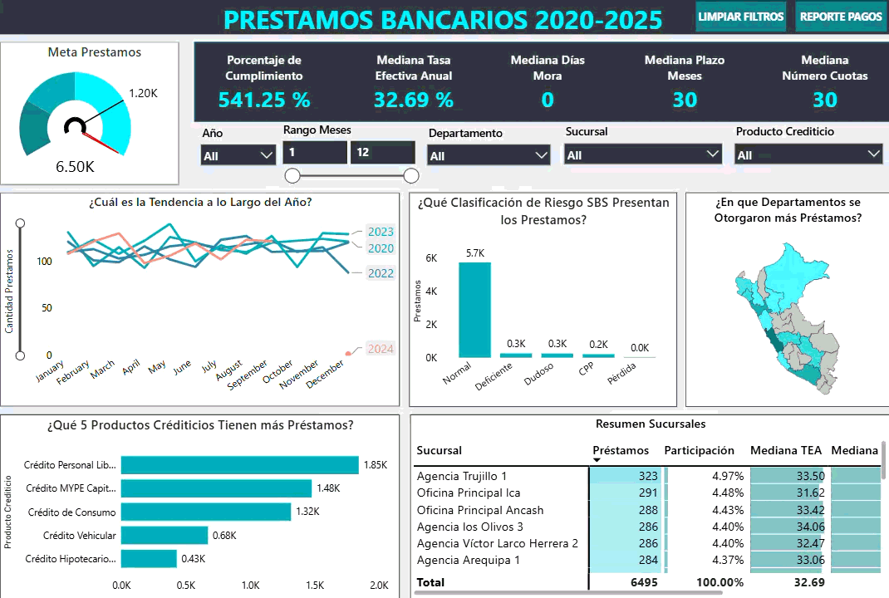

# Analisis-Integral-de-Creditos-Bancarios

## Introducción

Este es un proyecto integral que busca representar las diferentes etapas de un proceso ETL y demostrar la integración entre diversas herramientas utilizadas en el análisis y la gestión de datos.

## Resumen del Proyecto

### Etapa 1: Data Warehouse
---

Extraer -> Archivos csv.  
Transformar -> Limpieza e integridad (Python).  
Load (cargar) -> Base de datos Relacional (SQL Server).  
Esta etapa inicial tiene como objetivo crear una fuente de datos limpia, confiable y estructurada para el análisis posterior.

### Etapa 2: Análisis de Datos
---

Se realiza un análisis exploratorio de los datos, utilizando python y Notebooks con el objetivo de comprender su comportamiento general, identificar patrones relevantes y generar información de impacto para el negocio. 

### Etapa 3: Reporte de Ventas
---

Se desarrolla un reporte interactivo en Power BI para visualizar indicadores clave, facilitar la toma de decisiones y comunicar el estado del negocio de manera clara y efectiva.

## Habilidades Demostradas
---
* **SQL Server:** Desarrollo de comando DDL, procedimientos almacenados y manejo de errores.
* **Python:**: Se utilizan librerias como, pandas para limpieza, manipulación y transformación de los datos, así mismo también se utilizan librería como  matplotlib y seaborn, para la visualización de información mediante gráficos. 
* **Power BI:** Creación de visualizaciones interactivas mediante gráficos y filtros, utilizando Power Query, DAX, métricas y parámetros.
* **Herramientas de Planificación:** Planificación y seguimiento de cada etapa del proyecto mediante herramientas como Draw.io y Notion, garantizando una ejecución organizada y alineada con los objetivos.

## Conclusiones
Para alcanzar los objetivos planteados, se emplean diferentes tecnologías, cada una con una función específica dentro del flujo de trabajo. 
* **SQL Server:** Un centro de datos donde podemos tener la información original como respaldo (Capa Bronce), información limpia y tratada (Capa Plata) e información lista para el negocio, reportes o machine learning (Capa Oro).
* **Python:**: Se aprovecha la flexibilidad del lenguaje, la existencia de librerías centradas en el tratamiento de datos para poder limpiar y visualizar información.
* **Power BI**: Un herramienta de visualización de información, permite transformar datos en información relevante para la toma de decisiones empresariales.  
 
## Sobre Mi 
Buenos días, buenas tardes o buenas noches, dependiendo de cuando leas esto, soy Estudiante de Ing. Sistemas mi nombre es Danfer Marcelo Ore, este proyecto busca demostrar mi capacidad para poder planificar, integrar e implementar diversas tecnologías como SQL Server, Power Bi y Python.
